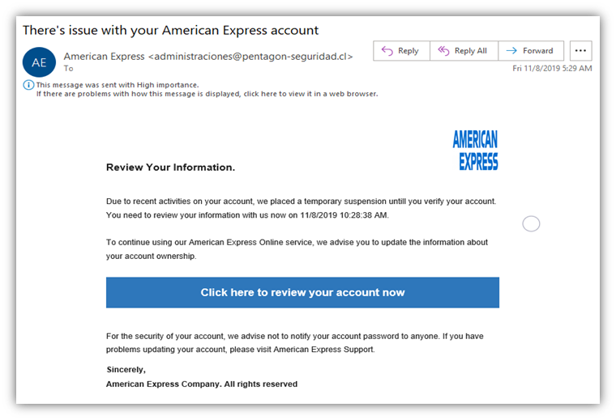

# Inject practice
Tags: injects

## Description
This skill practice is designed to give you practice analyzing and responding to injects. Injects are business documents and requests that the CCDC team is required to fulfill and respond to while also defending the system network.

## Goal
Craft a response to the given inject in 15 minutes or less.

## Process
1. Read the given inject prompt
2. Craft your response
3. Compare your response with the example and checklist below

## Inject Prompt
| Inject Info | |
| ----------- | ----------- |
| Inject Name      | Analyze a Business Email|
| Inject ID | ABE-010 |

The CIO of the company received this email and we have sent it to you to review. Please analyze the email and respond with information about whether or not this email is legitimate. How you can you tell? 

The CIO also hopes to establish a phishing process for the company. Describe what steps you would take to establish a phishing process and how you would measure its success. 

## Inject Response Example
lorem ipsum decorum

## Inject Checklist
1. Inject response is in memo format
1. Inject addresses the appropriate party
1. Inject response subject matches the name of inject request
1. The only identifying information in the inject response is the team number
1. Screenshots in the inject response are centered
1. Screenshots in the inject reponse are labeled
1. Language in the inject response is business-oriented and avoids technical jargon
1. The inject response covers every request listed in the inject request